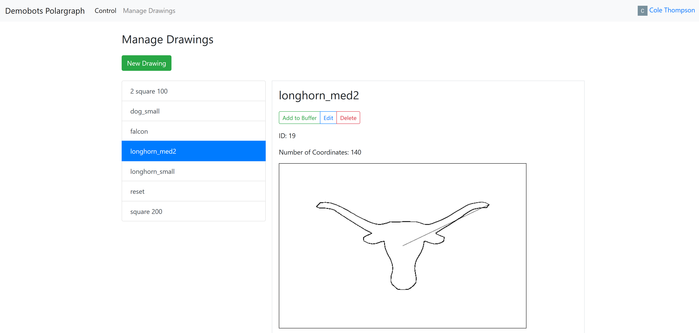

# Demobots Polargraph IOT
UT Austin's R.A.S. Demobots made an Arduino polargraph on an ESP8266, and this example adds a Google App Engine front end and communication through Cloud IoT Manager's HTTP bridge.  
 
Currently hosted on utras-demobots.appspot.com but you must be an admin to control anything. 
 
Cloud IOT provides a simple and secure REST API (cloudiotdevice) for the device to post state and get config to the device manager. The device manager stores some of the most recent states and configs, and another API (cloudiot) can access the device manager.  
 
Google AppEngine is a platform for building webapps, it hosts webapp and gives you access to diagnostic tools.  
 
If you deploy the project to appengine instead of running the server locally, pay attention to Cloud's pricing and data quotas, there is a free trial but the credits will run out eventually.

## Google Cloud Tutorials
AppEngine Tutorial: Setting up gcloud development environment, python bookshelf app, Flask, Jinja, OAuth, CloudSQL 
https://cloud.google.com/python/getting-started/tutorial-app 
Cloud IoT How-To's: Config, state, HTTP bridge  
https://cloud.google.com/iot/docs/how-tos/getting-started 
Cloud IoT REST Reference: APIs for the HTTP device manager (cloudiot) HTTP bridge (cloudiotdevice) 
https://cloud.google.com/iot/docs/reference/rest/ 
Cloud IoT Manager Example: Using python client library to connect to IoT device manager with cloudiot API 
https://github.com/GoogleCloudPlatform/python-docs-samples/tree/master/iot/api-client/manager 
Cloud IoT Core JWT Arduino library: Cloud IoT end device examples on Arduino, JWT, receiving config, updating state, sending telemetry to PubSub with cloudiotdevice API 
https://github.com/GoogleCloudPlatform/google-cloud-iot-arduino 

## Arduino Libraries
ESP8266WiFi 
Google Cloud IoT Core JWT 
AccelStepper 
rBase64 
QueueList 

## Google Cloud Services
Google App Engine (python with Flask, Jinja, SQLAlchemy) 
OAuth 2.0  
Cloud SQL  
Cloud IoT Manager with HTTP bridge 

 

## Google Cloud Console Stuff to Set Up
Things to do when setting up this project. In general, follow the examples and tutorials.
* Google Cloud Project
* Cloud SQL Instance and drawings Database
* Cloud IOT Registry and Device with EC Public Private Key Pair and Service Account
* Enable all API's - Cloud IoT, AppEngine Flexible, Cloud SQL, CLoud SQL Admin, Google+, (might be more)
* Config files were not committed for security reasons, so make copies of everything with "\_EXAMPLE", remove the "\_EXAMPLE", and fill in your info, read comments for instructions

## Running AppEngine Locally (Linux)
First, make sure that project is set up like in Bookshelf tutorial, Google Cloud SDK is installed, and config.py/app.yaml are set up. 
virtualenv -p python3 env 
source env/bin/activate 
pip install -r requirements.txt 
python main.py 

## Running Cloud SQL Locally (Linux)
Install Proxy: 
wget https://dl.google.com/cloudsql/cloud_sql_proxy.linux.amd64 -O cloud_sql_proxy 
chmod +x cloud_sql_proxy 
Run Proxy: 
./cloud_sql_proxy -instances=project-name:us-central1:sql-name=tcp:3306 

## Hardware
 * [ESP8266 ESP 12-E WiFi Development Board](https://www.amazon.com/Makerfocus-ESP8266-ESP-12E-Internet-Development/dp/B01IK9GEQG)
 * 2x [NEMA 17 2A Stepper Motors](https://www.amazon.com/Stepper-Bipolar-4-lead-Connector-Printer/dp/B00PNEQKC0/ref=sr_1_4?ie=UTF8&qid=1517537888&sr=8-4&keywords=nema+17+stepper+motor&refinements=p_72%3A2661618011)
 * 2x [A4988 Pololu Stepper Drivers](https://www.pololu.com/product/1182)

## TODO
Come to Demobots meetings or message R.A.S. if you want to participate! Any ideas are welcome. We are going to set up a more official task system in the future, but for now here are some tasks.

#### Arduino:
* Move the update state/config HTTP requests onto a separate thread from the Steppers
* Serial Mode (takes config as string)
* Minimize size and number of config transmissions for drawings

#### Cloud:
* Maybe using device metadata would be helpful for stuff like polargraph size, wifi connection settings, etc
* PubSub could be cool for drawings instead of using config
* Cloud IoT also has an MQTT bridge we can try

#### AppEngine:
* Editable canvas in Add Drawing
* Improve SVG tools to handle multiple paths
* SVG polargraph size text input
* Background thread or task queue when number of coordinates needs multiple configs

#### Hardware:
* New pen holder, possibly with a small servo to lift/place the pen
* Big reset / stop / motor power buttons (use interrupts for stop)
* Surface for drawing with dry erase markers
* Find an appropriate battery pack for outdoor demos
