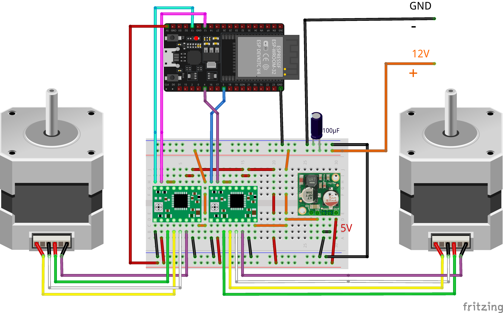

# Demobots Polargraph IoT

Automated Drawing Robot originally built by the 2018-2019 Demobots comittee.

### [For current demonstration instructions, click here!](#demonstration-instructions)

Demobots is currently working on improving and adding to features to Polargraph (as of 2023).

This repo contains different codebases: PolargraphESP32 (maintained) and PolargraphArduinoGIOT (deprecated, but may be visited sometime in the future).

### Updates:

Currently working on the PolargraphESP32 code, getting it to a more easy to use state. 

More detailed user instructions for demonstrations will follow soon. 
 
# How does it work?

## Codebase

(Both require the [AccelStepper](https://www.airspayce.com/mikem/arduino/AccelStepper/index.html) library)

### [PolargraphESP32](PolargraphESP32) (Maintained)
Runs on an ESP32 in FreeRTOS. Hosts a web server and control interface on the device, and can either connect to an access point or deploy one. Allows user to upload SVG drawing for robot to draw.

### {DEPRECATED} PolargraphArduinoGIOT 
The deprecated PolargraphArduinoGIOT version is included [here](DEPRECATED_FILES/PolargraphArduinoGIOT), but hasn't been touched since 2019, feel free to look into it. 
Runs on an ESP8266. Uses Google Cloud IOT device manager for communication, and connects to an AppEngine webserver in polargraph_appengine.

## Electrical
 * [ESP32-PICO-KIT V4 / V4.1](https://docs.espressif.com/projects/esp-idf/en/latest/esp32/hw-reference/esp32/get-started-pico-kit.html#get-started-pico-kit-v4-board-front)
 * 2x [NEMA 17 2A Stepper Motors](https://www.amazon.com/Stepper-Bipolar-4-lead-Connector-Printer/dp/B00PNEQKC0/ref=sr_1_4?ie=UTF8&qid=1517537888&sr=8-4&keywords=nema+17+stepper+motor&refinements=p_72%3A2661618011)
 * 2x [A4988 Pololu Stepper Drivers](https://www.pololu.com/product/1182)
 * [5V, 5A Step-Down Voltage Regulator D24V50F5](https://www.pololu.com/product/2851)
 * 12V, 24-36W DC Power Supply
 * 100uF, 50V Capacitor
 * Breadboard with Jumpers

### Circuit Diagram 

*WIP*

### Breadboard Diagram
Note that the MS1 and MS2 pins of each A4988 Stepper Driver are both 5V high, this sets the stepper motors to eighth step, refer to the [A4988 pinout](Electrical/A4988_pinout.png) as needed.

The exact order of the stepper driver output wires depends on the stepper motor used, refer to the [A4988 pinout](Electrical/A4988_pinout.png) as needed.
 

*An ESP32-PICO-KIT Fritzing part doesn't exist as of writing, the other ESP32 board was used just to illustrate the pin connections.*

## Upgrades In the Works
 * Whiteboard paneling with dry-erase, to save paper and to allow erasing.
 * Marker/pen actuation, allowing for marker to be moved up/down, to avoid ugly travel lines.

## Contributors
 - Jake (Demobots Head) (4jakers18 on the RAS Discord server) 
 - Cole Thompson, the RAS Alum who created/maintained the code for this bot back in 2018
##
  
# Demonstration Instructions

